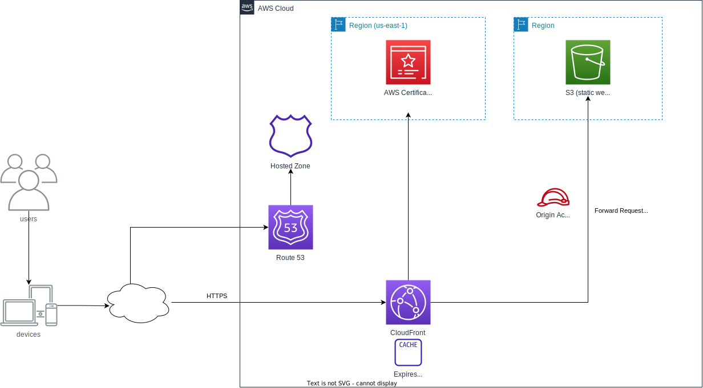

# CloudFront S3 Secure Website

## Introduction
This template consists of secure static website deployment using:

- `Amazon Simple Storage Service (Amazon S3)` all the static content is stored in an S3 bucket. To update the website just upload new files to a given S3 bucket (Check the important notes section for more details about cache invalidation)
- `Amazon CloudFront` CloudFront distribution serves the website to viewers with low latency. The distribution is configured with an origin access identity to make sure that the website is accessible only through CloudFront, not directly from S3
- `AWS Certificate Manager (ACM)` enables the distribution to serve the website securely with HTTPS
- `AWS CloudFormation` This solution uses an AWS CloudFormation template to set up essential components

## Architecture

## Necessary pre-deployment steps:
- You should own a domain and manually register a new "Hosted Zone" using Route 53. If your domain hasn't been registered with Amazon make sure to properly configure Name servers in your domain registrar
SSL/TLS certificate is managed by ACM, however, this service is available only in `us-east-1` region. You should manually request a new certificate through the console and take note of the certificate ARN, CNAME name, and CNAME value (those values are required CloudFormation template's parameters)

## Template parameters:
- `Domain` name of the Hosted Zone of your existing domain without a leading dot. (e.g mydomain.com)
- `DistributionOriginId` (Optional) a unique identifier for the origin. This value must be unique within the Cloud Front distribution. By default value is equal to `S3OriginWebsite`
- `AcmCertificateArn` ARN of manually created SSL/TLS certificate in `us-east-1` region
- `AcmCertificateCNAME` and `AcmCertificateCNAMEValue` When you choose DNS validation, ACM provides you with one or more CNAME records that must be added to this database. These records contain a unique key-value pair that serves as proof that you control the domain.

## Next steps and possible improvements:
- [ ] Review delete and update policies of template's resources

## Important notes:
- Cloud Front distribution is configured only with GET, HEAD, and OPTIONS methods. If you need to use another method template modification is necessary.
- Cloud Front distribution automatically redirects HTTP requests to HTTPS (ViewerProtocolPolicy)
- By default, Cloud Front will apply edge location caching with TTL=1day in case of website update and need for immediate changes cache invalidation must be created manually